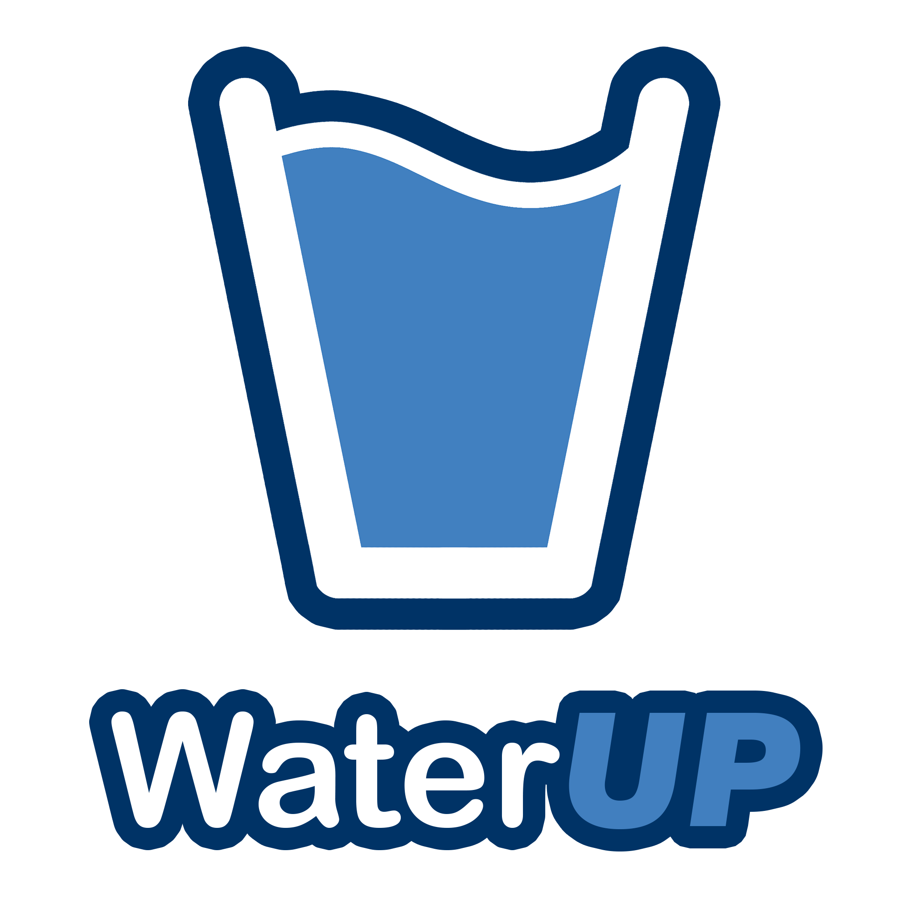

# WaterUp Mobile App

<p align="center">
  
</p>


[](LICENSE.txt)

WaterUp is a mobile application developed with Flutter that helps users track their daily hydration levels. Available on the App Store, it calculates the required water intake based on your personal data, offers a variety of beverage options, and provides insightful history features to monitor your progress.

## Project's Development

This project is a collaborative effort developed by [@alqeren1](https://github.com/alqeren1) and [@enverenes](https://github.com/enverenes).


## Table of Contents

- [Overview](#overview)
- [Features](#features)
- [Technologies Used](#technologies-used)
- [Installation & Setup](#installation--setup)
- [Usage](#usage)
- [App Store & Social Media](#app-store--social-media)
- [License](#license)
- [Contact](#contact)

## Overview

WaterUp is designed to empower you to stay hydrated and healthy. By inputting your personal details, the app calculates your daily water intake and lets you track consumption throughout the day. In addition to water, you can log various other beverages, such as milk and coffee. With both daily and weekly history views (premium features), WaterUp enables you to adjust your habits and reach your hydration goals.

## Features

- **Custom Hydration Goals:** Set personalized water intake targets.
- **Multiple Drink Types:** Track not just water, but a range of beverages.
- **History Tracking:** View your daily and weekly intake history (Premium feature).
- **Customizable Cup Sizes:** Adjust measurements to match your preferred cup sizes.
- **Reminders:** Receive notifications to help you stay on track (Premium feature).

## Technologies Used

- **Flutter:** For cross-platform mobile development.
- **Dart:** Programming language used with Flutter.

## Installation & Setup

To run WaterUp locally for development:

1. **Clone the Repository:**

   ```bash
   git clone https://github.com/alqeren1/waterup.git
   ```

2. **Navigate to the Project Directory:**

   ```bash
   cd waterup
   ```

3. **Install Dependencies:**

   ```bash
   flutter pub get
   ```

4. **Run the App:**

   ```bash
   flutter run
   ```

## Usage

WaterUp is designed to be intuitive:
- Launch the app and enter your personal details.
- Set your custom hydration goal.
- Log your water and other beverage intakes throughout the day.
- Monitor your progress with daily and weekly history charts.

## App Store & Social Media

- **Download on the App Store:** [WaterUp on the App Store](https://apps.apple.com/us/app/water-tracker-waterup/id1663081515?platform=iphone)
- **Follow on Instagram:** [WaterUp on Instagram](https://www.instagram.com/waterup_app/)

## License

This project is licensed under the [MIT License](LICENSE).

## Contact

For any inquiries or further information, please reach out at [alqeren1@gmail.com](mailto:alqeren1@gmail.com).

---
